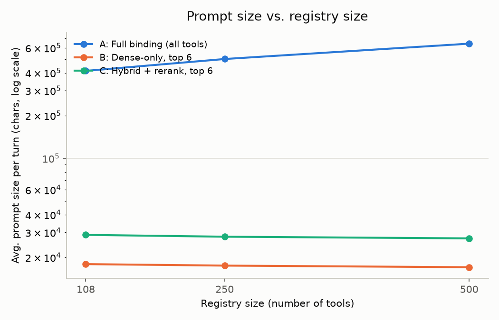

# Switchboard — Report

## 1. Thesis

An LLM given 500 tool definitions performs worse than one given 6. Tool descriptions consume
context, similar tools blur together, and the model picks wrong or hallucinates parameters. Prompt
engineering does not fix this — it is a scaling wall. **Tool selection at scale is a retrieval
problem, not a prompting problem.** If the model never sees more than 8 tools per turn, the prompt
it receives stops growing with the registry, and accuracy stops being a direct function of registry
size.

That claim is measured, not asserted. Switchboard's registry scales from 108 real tools to 500
(108 real PayPal tools across 11 OpenAPI specs, padded with 392 real GitHub API tools). Across that
range:



Full binding — showing the model every tool at once — grows from ~413K to ~642K characters of
prompt as the registry scales 108→500. The retrieval-gated arms (dense-only, hybrid+rerank) stay
flat at ~17–29K characters regardless of registry size, because they only ever bind the top 6
retrieved candidates. That flat line is the thesis, measured directly with zero LLM calls — see
`docs/RESULTS.md` for the full numbers, and for an honest account of what *isn't* claimed here (the
chart shows prompt size, not accuracy — section 5 explains why, and what the accuracy picture
actually looks like).

## 2. Agent structure

Switchboard is a LangGraph state machine, not a linear chain, because the actual control flow has
branches and loops that a chain can't express: a validation failure needs to loop back to argument
filling (capped at 2 retries); a write-class tool needs to *pause* mid-turn for human approval and
resume later, not just proceed; low-confidence retrieval needs to divert to a clarifying question
instead of guessing. LangGraph's `interrupt()` and SQLite checkpointer make the pause-and-resume
case a first-class primitive rather than something bolted onto a linear pipeline.

The funnel, per turn:

```
plan → {chat | system_search | retrieve_tools}
retrieve_tools → bind → fill → validate → {fill (retry) | clarify | approve_gate}
approve_gate → {dry_run | execute | rejected}
execute → observe
```

`plan` classifies the turn (chat / retrieve-and-act / meta) via a single structured-output Gemini
call. `retrieve_tools` calls the shared retrieval path (section 3). `bind` loads full JSON Schemas
for only the retrieved candidates — schemas never enter context before this point. `fill` is two
Gemini calls, not one (section 3 explains why). `validate` runs the filled arguments through
`jsonschema.validate` against the tool's real request schema; failures feed the validator's error
message back into a repair `fill` call, capped at 2 retries, costing no additional user round-trips.
`approve_gate` calls `interrupt()` for any write-class or high-risk tool, unless `--dry-run` is set,
in which case the call is described and the turn ends without ever reaching the interrupt or
`execute`. A hard step cap (15) guards every conditional edge against a runaway loop that isn't
converging.

Nine terminal/near-terminal node types exist beyond the happy path: `chat`, `system_search`,
`clarify`, `dry_run`, `rejected`, `abort` — each a distinct, intentional way a turn can end besides
a successful execution.

## 3. Tool selection and routing

**Cards vs. schemas.** Every `ToolRecord` carries a short card (name, summary, description,
keywords, utterances) that gets embedded and BM25-indexed, and a `schema_ref` pointing into a
separate on-disk schema store. The full JSON Schema — often several KB with nested `$ref`/`allOf`
chains in PayPal's real specs — never enters the vector index and never enters an LLM prompt until
`bind` loads it for the (at most 6) retrieved candidates. This is the mechanism behind section 1's
flat prompt-size line.

**Hybrid over dense.** `routing/router.py` runs dense (Qdrant, `gemini-embedding-001`, top 30) and
sparse (BM25Okapi, top 30) in parallel, fuses with reciprocal rank fusion (k=60, no weight tuning),
then reranks the fused candidates with an off-the-shelf cross-encoder
(`cross-encoder/ms-marco-MiniLM-L-6-v2`) down to the final 6. Phase 2's smoke test hit 10/10 on
hand-picked near-miss pairs (`invoices.create` vs `invoices.send`; `captures.refund` vs
`invoices.refunds`). Phase 7's benchmark complicates this cleanly-positive story, honestly: at
every registry size, hybrid+rerank actually recalls the correct tool *less* often than dense-only
alone (0.72 vs 0.83 at 108 tools; 0.70 vs 0.80 at 500 — see `docs/RESULTS.md`). Six concrete
spot-checked cases show the untuned cross-encoder — trained on general web query-passage relevance,
not this domain — biased toward tool cards that read as direct action fulfillment over list/read/
knowledge cards, in two cases dropping the actually-correct tool (`plans.list`, `rag_search`)
entirely from its top 6 after BM25 fusion pulled in lexically-similar but semantically wrong
neighbors. This is a real, measured cost of "off the shelf, not tuned" — not a hypothetical caveat.

**Why utterances.** Each `ToolRecord`'s 3–5 LLM-generated utterances are, empirically, the single
highest-leverage ingestion decision. Spot-checking enriched near-miss pairs (`invoices.create` vs
`invoices.send`; `plans.create` vs `subscriptions.create`; `subscriptions.suspend` vs `.cancel`)
shows utterances doing the actual disambiguation work — sharing almost no path tokens but capturing
the distinct *intent* each phrasing implies. The PRD's own `C minus` ablation (utterances removed)
was cut under time pressure (see section 8) rather than measured, which is a real gap: the claim
that utterances matter is well-supported qualitatively but not benchmarked quantitatively here.

**Filters and load-on-demand binding.** `router.retrieve(query, filters)` accepts payload filters
(`service`, `domain`, `operation`) applied to both dense and sparse legs before fusion — `plan`
emits an `operation: read|write` filter when it's confident about mutation intent, halving the
candidate pool before retrieval runs. Full schemas load exactly once, at `bind`, for exactly the
candidates that survive to that point — never earlier, never for the whole registry.

**Two-step fill, not one.** The first implementation asked a single Gemini call to both pick a tool
and fill its arguments, with a generic `{"tool_id": str, "args": object}` response schema. It
reliably returned `args: {}` — Gemini's structured decoding satisfies a loose `object` constraint
with an empty object regardless of prose instructions to fill nested required fields. Splitting into
(1) tool selection constrained to an enum of the 6 candidate ids, then (2) argument-filling using
*that specific tool's own* flattened schema as the `response_schema`, fixed this immediately:
constrained decoding only works when the schema itself encodes the real structure. Two bugs surfaced
while building the schema flattener (`graph/schema_utils.py`) against PayPal's real, not toy, nested
`allOf`/`$ref` schemas: a depth counter that silently truncated `currency_code` fields to bare
`{"type": "object"}` with no error (a correctness bug, not a crash — caught only by manually
inspecting an interrupt payload), and no breadth cap, which let a fully-expanded invoice schema
balloon past 40K characters and get rejected outright by Gemini's structured-output endpoint.

**`rag_search` and `system_search`: one index, two renderers.** `rag_search` is a normal 108th
`ToolRecord` (`domain=knowledge`) — it competes for retrieval slots exactly like any PayPal tool,
and when selected, `execute_node` runs a real dense search over a docs collection (24 chunks, real
PayPal prose from OpenAPI `info.description`/`tags[].description` fields — developer.paypal.com
itself is a JS-rendered SPA, unscrapable in the time available) instead of the mock-response path
every other tool gets. `system_search` is explicitly *not* a competing registry entry: it's a second
renderer over the identical `router.retrieve()` call, invoked when `plan` classifies a turn as
"meta," rendering matching tools as prose instead of binding them as callables. A real bug was
caught and fixed here: `plan` initially routed PayPal-specific conceptual questions ("how do refunds
work?") to generic "chat," bypassing `rag_search` entirely and answering from the model's own
training data instead of the actual docs corpus.

## 4. State management

`AgentState` is a `TypedDict` with three intended tiers, though only the first is fully built:

- **Working state** (`plan`, `filters`, `candidate_tools`, `selected_tool`, `filled_args`,
  `validation_errors`, `retry_count`, `steps`) is transient per turn and fully implemented — this is
  what every node reads and writes, and what the retry loop and step cap operate on.
- **`entities`** is declared in the schema (meant to persist resolved references like "that
  customer" across turns) but **no resolution logic writes to it** — this is a named gap, not a
  built feature. The golden set's `RESOLVE:henderson_order`-style markers are intentional
  placeholders for exactly this capability, and none of them currently resolve automatically.
- **`artifacts`** holds `bound_schemas` (from `bind`) and `last_execution` (from `execute`), which
  is real and working, but the PRD's specific intent — a large result (e.g. a 3MB transaction
  report) returning a handle instead of raw JSON dumped into context — is **not implemented**. Every
  mock response in this build is small enough that the gap hasn't bitten yet, but it's a real
  omission against the original design, not a deliberate simplification.

Persistence is a `langgraph-checkpoint-sqlite` `SqliteSaver`, keyed by `thread_id` — this is what
makes `interrupt()`/`Command(resume=...)` work across a CLI prompt boundary, and what lets
`system_search` answer "what's the status of my last request" from real state rather than nothing.
A separate, deliberately narrow JSONL trace log (`observability/tracing.py`) exists alongside the
full OTel/Phoenix instrumentation specifically to serve that one cheap lookup without querying
Phoenix's storage — two trace stores for two different consumers, not redundant.

## 5. Scalability

The measured result (section 1, `docs/RESULTS.md`) is prompt size, not tool-selection accuracy —
and that distinction is load-bearing, not a rounding error. The first attempt at a full-binding
*accuracy* metric ("is the expected tool the single nearest embedding neighbor across the whole,
unfiltered registry?") turned out to be mathematically identical to dense-only's top-1 pick —
nearest-neighbor-of-1 can't change based on how many additional results are also retrieved. It was
discarded once the math was checked, rather than reported as a real per-arm accuracy divergence.
Full binding's actual distinguishing failure mode — an LLM's attention/context degradation when
handed hundreds of tool schemas simultaneously — is not a retrieval-ranking phenomenon at all, and
can't be measured without real large-context generation calls at every registry size, which this
build's Gemini free-tier quota does not support (see section 7).

What *is* real: a small end-to-end validation sample (n=15, core/108-tool tier, actual Gemini calls
through the production `_select_tool` code path) shows the zero-cost retrieval proxy underestimating
true accuracy by 26 points (proxy 0.47 vs. real 0.73) — the model's own reasoning, given the same
6 retrieved candidates, recovers from several retrieval ranking mistakes the proxy alone gets wrong.
So the honest scaling story is: prompt size is flat and measured at full scale; tool-selection
accuracy is real but only sampled at the smallest tier; and the gap between those two facts is
disclosed rather than papered over with an extrapolated curve.

What breaks next, past what's measured here: registry ingestion cost (each new domain needs an
enrichment pass — cheap per-tool but linear in registry size, and this build hit daily LLM quota
limits repeatedly just enriching ~110 real tools); rerank latency at high `k` (the cross-encoder
reranks the full RRF-fused candidate set — 30+30 minus overlap — regardless of registry size, so
its cost is bounded by fusion width, not registry size, but a naive implementation that reranked the
whole registry would not scale); and cross-service planning (this build's `fill` picks exactly one
tool per turn; a request spanning PayPal + a hypothetical second payment provider would need
planning this design doesn't yet do).

## 6. Error handling

| Failure | Response | Status |
|---|---|---|
| Retrieval miss, low rerank score | Widen once, then `clarify` — never guess | Implemented (score threshold on rerank logit, no widen-once retry yet — goes straight to clarify) |
| Schema validation fails | Repair loop, validator errors fed back, capped at 2 | Implemented, tested |
| 400/422 from API | Feed error back once, escalate | N/A — execution is fully mocked |
| 401/403 | Never retry, escalate | N/A — mocked |
| 429/5xx | Backoff + circuit breaker per service | N/A for the mocked agent — but *this build's own tooling* hit exactly this failure class repeatedly against the real Gemini API (see section 7) and needed real backoff/model-swap handling to finish |
| Ambiguous entity ("user_123") | Resolve via a read tool first, or ask | **Not implemented** — `entities` state exists but nothing resolves into it (section 4) |
| Loop without progress | Hard step cap, abort with explanation | Implemented (cap = 15), tested |

Idempotency: every write call gets a deterministic key —
`sha256(trace_id:tool_id:sorted(args))` — so a retried "send $50" always carries the *same* key
across a graph resume, rather than a fresh one. Approval gate: `interrupt()` before any
`operation=="write"` or `risk=="high"` tool; `--dry-run` short-circuits before the interrupt is ever
raised, so a dry run can never pause waiting on a human.

## 7. Framework choices and trade-offs

- **LangGraph over CrewAI.** Explicit cyclic control flow, `interrupt()`-based approval, and durable
  checkpointing are load-bearing here — CrewAI's role abstraction hides control flow, the wrong
  trade when a wrong turn moves money.
- **LangGraph over plain LangChain.** Retry, clarify, and approval are branches and loops; a chain
  is linear.
- **Qdrant embedded in-memory, not Docker.** No Docker dependency for a 2-day build; the trade-off
  is the index rebuilds every process start, mitigated by caching embeddings to disk by content hash
  separately from the (ephemeral) collection.
- **Gemini, not OpenAI/Anthropic, for the LLM.** A pragmatic, quota-driven choice that turned out to
  cost real time: `gemini-2.5-flash` 404s as "no longer available to new users" despite showing
  quota in the console; the working alias (`gemini-flash-latest`) itself hit its 20 req/day cap
  mid-build and had to be swapped to `gemini-flash-lite-latest`; embedding and generation calls hit
  429s repeatedly during Phase 7's padding-tool enrichment and query embedding, requiring real
  backoff logic, not just a retry decorator. This is worth naming plainly: a free-tier key shaped
  several architecture decisions (the two-step fill split, the zero-LLM-call benchmark design) more
  than the PRD anticipated.
- **Native structured output over ReAct text parsing.** Fewer parse failures, provider-enforced
  schemas — but only once the schema handed to the endpoint actually encodes real structure
  (section 3's two-step fill finding).
- **Phoenix over LangSmith.** Open source, OTel native, runs locally — `cli.py chat` launches it
  automatically. Two Windows-specific integration bugs were found and fixed getting there: a
  cp1252-console crash on Phoenix's own emoji banner, and a default gRPC port (4317) colliding with
  an unrelated pre-existing process on this machine (worked around, never touched).
- **Cross-encoder reranker, off the shelf, not fine-tuned.** Section 3 shows the real, measured cost
  of that choice — worth weighing against a domain-tuned reranker as future work (section 8).
- **DSPy.** Named as future work for optimizing the planner/fill prompts against the golden set —
  not used here.

## 8. Limitations and what I would build next

Named plainly, in the spirit of the PRD's own instruction that a named weakness with a measurement
attached is worth more than a claim of none:

1. **The golden set is entirely AI-generated, not hand-written.** A direct, disclosed
   deviation from the PRD's explicit instruction to write it yourself — the real risk this creates
   (an AI generating both the routing system and its own eval queries can correlate blind spots) is
   named here rather than hidden. What I'd build next: a genuinely hand-written 50–60 query set,
   written blind to this system's known behavior.
2. **Retrieval gating's inherent hard failure mode** (per the PRD): if the correct tool misses the
   top 6, this agent cannot recover the way a full-binding agent theoretically might. Mitigated by
   measuring recall@6 directly and routing low-confidence turns to `clarify` rather than guessing —
   but not eliminated.
3. **The untuned cross-encoder reranker measurably hurts recall vs. dense-only alone** at every
   registry size tested (section 3, section 5). Next: either fine-tune a reranker on this domain's
   query/tool pairs (the generated utterances are a ready-made training signal) or make reranking
   conditional on whether it's actually improving the candidate set.
4. **Entity resolution and artifact handles are unimplemented** despite being in the state schema
   (section 4) — the golden set's `RESOLVE:`-marked queries (e.g., "the acme invoice," "the
   Henderson subscription") don't currently resolve to anything. This is the single largest gap
   between the design as specified and the system as built.
5. **Multi-step tool sequencing is out of scope** (accepted per the PRD's own cut list) — `fill`
   picks one tool per turn; a query like "invoice acme, then send it, then note it in the report"
   is scored on its first tool only.
6. **Live execution was never implemented** (accepted cut) — every tool call in this build is
   mocked; `execute_live()` raises rather than silently no-op'ing.
7. **Padding tools are cross-domain** (GitHub's API, not another payments API) — likely understates
   real degradation, since unrelated tools rarely become plausible retrieval distractors. Next:
   pad with same-domain APIs (Stripe, other payment processors) for a harder, more realistic test.
8. **The full accuracy-vs-scale curve for all three arms was never measured with real LLM calls** —
   only a 15-query sample at the smallest tier. Given a key with real quota headroom, the natural
   next step is exactly the benchmark the PRD originally specified, run for real at every size.
9. **The benchmark ran once per configuration, not averaged over seeds** — a PRD-anticipated
   honesty flag, true here as everywhere.
10. **Quota constraints shaped this build's process, not just its output** — repeated 429s and one
    model deprecation mid-session forced real-time architecture decisions (two-step fill, the
    zero-LLM-call benchmark split) that a well-resourced key wouldn't have required. Worth naming as
    context for anyone trying to reproduce these exact numbers on a different account.
