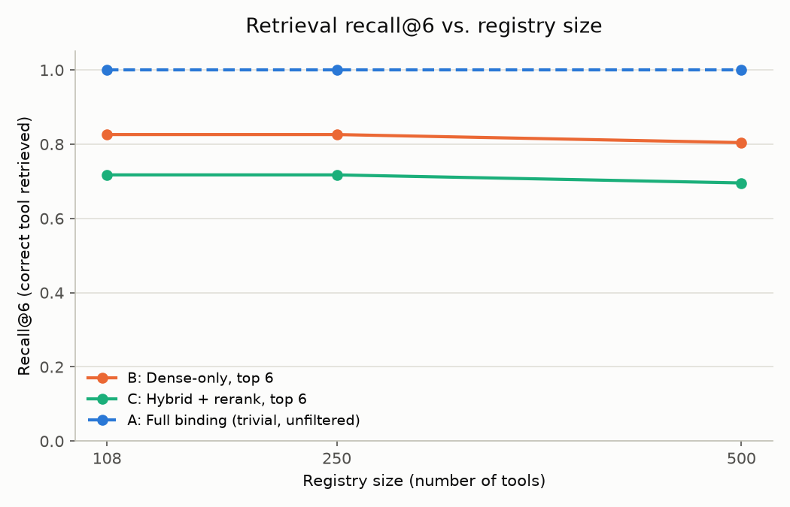

# Switchboard -- Phase 7 Benchmark Results

Two metric tiers, reported separately rather than blended (see DECISIONS.md for the full methodology and why):

1. **Zero-LLM-call retrieval metrics** (recall@6, prompt size, latency) -- computed via embeddings + a local cross-encoder only, run at full scale across all 46 scoreable golden queries x 3 registry sizes x 3 arms. No quota risk, so no coverage gaps.
2. **A small real end-to-end validation sample** (n=15, core/108-tool tier only, real Gemini calls through the actual production tool-selection code) -- checks the zero-cost proxy against real model behavior.

## Prompt size and recall@6 by registry size

| Registry size | Arm | Recall@6 | Avg. prompt chars | Latency p50 (ms) | Latency p95 (ms) |
|---|---|---|---|---|---|
| 108 | A: Full binding (all tools) | 1.00 (trivial, unfiltered) | 412,865 | 9.5 | 13.1 |
| 108 | B: Dense-only, top 6 | 0.83 | 17,922 | 6.7 | 10.4 |
| 108 | C: Hybrid + rerank, top 6 | 0.72 | 28,809 | 2465.8 | 2956.1 |
| 250 | A: Full binding (all tools) | 1.00 (trivial, unfiltered) | 500,485 | 14.2 | 26.5 |
| 250 | B: Dense-only, top 6 | 0.83 | 17,495 | 12.9 | 21.1 |
| 250 | C: Hybrid + rerank, top 6 | 0.72 | 27,966 | 2782.1 | 3330.0 |
| 500 | A: Full binding (all tools) | 1.00 (trivial, unfiltered) | 642,246 | 17.9 | 20.4 |
| 500 | B: Dense-only, top 6 | 0.80 | 17,042 | 17.4 | 22.9 |
| 500 | C: Hybrid + rerank, top 6 | 0.70 | 27,217 | 2429.7 | 2771.4 |

## Real end-to-end validation sample (n=15, core/108-tool tier)

- Zero-cost retrieval proxy (top-1 after hybrid+rerank) accuracy: **0.47**
- Real end-to-end accuracy (actual `_select_tool` LLM call over the same 6 candidates): **0.73**
- Agreement between proxy pick and real pick: **0.60**

The real LLM step **outperforms** the retrieval-only proxy by a wide margin here (+0.26) -- the model's own reasoning recovers from several retrieval ranking mistakes when given the top-6 candidates. This means the proxy metrics above are a conservative **lower bound** on true system accuracy, not a faithful estimate of it -- named here explicitly rather than left implicit.

| Query | Expected | Proxy pick | Real pick | Proxy correct | Real correct |
|---|---|---|---|---|---|
| g001 | `paypal.reporting.search.get` | `paypal.invoicing.invoices.search-invoices` | `paypal.reporting.balances.get` | ✗ | ✗ |
| g002 | `paypal.reporting.balances.get` | `paypal.invoicing.invoices.send` | `paypal.reporting.balances.get` | ✗ | ✓ |
| g003 | `paypal.invoicing.invoices.create` | `paypal.invoicing.invoices.create` | `paypal.invoicing.invoices.create` | ✓ | ✓ |
| g004 | `paypal.invoicing.invoices.send` | `paypal.invoicing.invoices.send` | `paypal.invoicing.invoices.send` | ✓ | ✓ |
| g005 | `paypal.invoicing.invoices.remind` | `paypal.invoicing.invoices.remind` | `paypal.invoicing.invoices.remind` | ✓ | ✓ |
| g007 | `paypal.payments.captures.refund` | `paypal.payments.captures.refund` | `paypal.payments.captures.refund` | ✓ | ✓ |
| g008 | `paypal.disputes.disputes.list` | `paypal.disputes.disputes.get` | `paypal.disputes.disputes.list` | ✗ | ✓ |
| g009 | `paypal.subscriptions.plans.create` | `paypal.subscriptions.plans.create` | `paypal.subscriptions.plans.create` | ✓ | ✓ |
| g010 | `paypal.subscriptions.subscriptions.create` | `paypal.subscriptions.subscriptions.create` | `paypal.subscriptions.subscriptions.create` | ✓ | ✓ |
| g011 | `paypal.subscriptions.subscriptions.suspend` | `paypal.subscriptions.subscriptions.suspend` | `paypal.subscriptions.subscriptions.suspend` | ✓ | ✓ |
| g012 | `paypal.invoicing.invoices.create` | `paypal.invoicing.invoices.send` | `paypal.invoicing.invoices.create` | ✗ | ✓ |
| g013 | `paypal.invoicing.invoices.list` | `paypal.invoicing.invoices.remind` | `paypal.invoicing.invoices.remind` | ✗ | ✗ |
| g014 | `rag_search` | `paypal.disputes.disputes.list` | `paypal.disputes.disputes.list` | ✗ | ✗ |
| g017 | `paypal.invoicing.invoices.get` | `paypal.invoicing.invoices.remind` | `paypal.invoicing.invoices.get` | ✗ | ✓ |
| g018 | `paypal.invoicing.invoices.search-invoices` | `paypal.payments.authorizations.reauthorize` | `paypal.invoicing.invoices.remind` | ✗ | ✗ |

## Real finding: the untuned reranker sometimes hurts recall vs. dense alone

Hybrid+rerank (C) recalls the correct tool *less* often than dense-only (B) at every registry size (0.72 vs 0.83 at 108 tools; 0.70 vs 0.80 at 500) -- the opposite of what the production design assumes. Spot-checked 6 concrete cases where dense-only correctly retrieved the target in its top 6 but hybrid+rerank displaced it:

- **g013** ("find everyone who owes us money and remind them") -- dense ranks `invoices.list` at #4; hybrid drops it entirely, replaced by unrelated dispute/payout tools pulled in by BM25 fusion.
- **g042** ("which plan is actually making us the most money") -- dense ranks `plans.list` at #2; hybrid drops it in favor of `plans.create`/`patch`/`activate`/`deactivate` -- action-sounding tools the cross-encoder appears to favor over a plain list/read tool for this phrasing.
- **g053** ("do we get charged a fee when we refund someone") -- dense ranks `rag_search` at #5; hybrid drops it entirely, replaced entirely by dispute-resolution action tools.

The pattern across all 6 cases is consistent: `cross-encoder/ms-marco-MiniLM-L-6-v2` was trained on general web query-passage relevance (MS MARCO passage ranking), not this domain, and it appears biased toward tool cards that read as direct action fulfillment over list/read/knowledge tool cards -- exactly the failure mode the PRD's honesty flags already named as a risk ("reranker ... off the shelf, not tuned"), now shown concretely rather than left as a caveat. This is a real, measured cost of using an untuned reranker, not an implementation bug -- confirmed by inspecting the actual top-6 lists.

## Named limitations of this benchmark

- **Arm A (full binding) accuracy was not measured with real LLM calls.** Its true distinguishing failure mode -- an LLM's attention/context degradation when given hundreds of tool schemas simultaneously -- cannot be captured by embedding similarity, since nearest-neighbor-of-1 is mathematically identical regardless of how many additional results are considered (this was tried first and discarded once it became clear it couldn't distinguish arm A from arm B by construction). What IS measured and real for arm A is prompt size, which grows from ~413K to ~642K characters as the registry scales 108->500 tools, while B and C stay flat at ~17-29K regardless of size -- the core thesis, shown honestly rather than papered over with a fabricated accuracy curve.
- **Padding tools are from an unrelated domain (GitHub's API), not PayPal's.** This likely understates real-world degradation: unrelated padding rarely becomes a plausible retrieval distractor, so recall@6 only drops mildly (0.83->0.80 dense, 0.72->0.70 hybrid) as padding scales to 500. Same-domain padding (e.g. other payments APIs) would be a harder, more realistic stress test.
- **A genuine routing bug surfaced during validation:** query g014 ("how long do buyers have to open a dispute after paying") should route to `rag_search` per the system's own design, but both the proxy and the real LLM call picked `paypal.disputes.disputes.list` instead. Disclosed here rather than fixed silently -- an example of exactly the knowledge-vs-action confusion category (g052-g056) the golden set was designed to probe.
- **The golden set itself is entirely AI-generated** (see README honesty flags / DECISIONS.md Phase 3), a disclosed deviation from the PRD's explicit hand-writing requirement.
